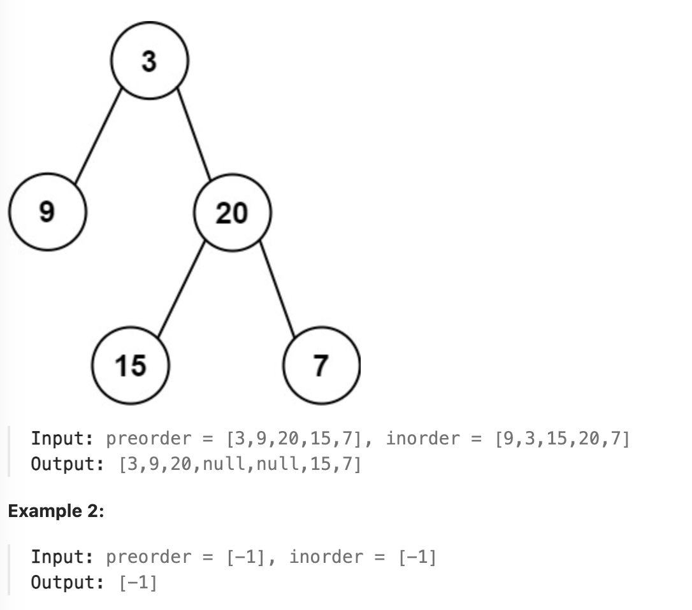

# leetcode - medium
# 105 binary tree from preorder and post order 

Given two integer arrays preorder and inorder where preorder is the preorder traversal of a binary tree and inorder is the inorder traversal of the same tree, construct and return the binary tree.

## Example

## Constraints
* 1 <= preorder.length <= 3000
* inorder.length == preorder.length
* -3000 <= preorder[i], inorder[i] <= 3000
* preorder and inorder consist of unique values.
* Each value of inorder also appears in preorder.
* preorder is guaranteed to be the preorder traversal of the tree.
* inorder is guaranteed to be the inorder traversal of the tree.

## Solution
